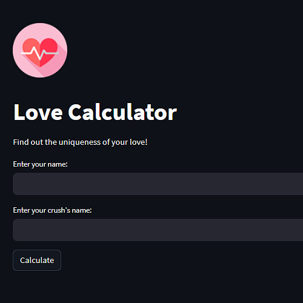

# Love Calculator


Welcome to the Love Calculator project! This is a simple web application built with Streamlit that allows users to calculate the uniqueness of love between two individuals based on their names. The application generates a love percentage and displays a result with a touch of fun and creativity.

## Features

- Enter two names and calculate the uniqueness of love between them.
- Get a love percentage result along with a playful message.
- Special case: If both names are "dirgahalimsusilosarasputrimuizza", the love percentage is always 100%.

## Demo

You can try out the Love Calculator application by visiting the live demo [here](#). Enter your name and your crush's name, then click the "Calculate" button to see the magic happen!

## Screenshots



## Installation

1. Clone this repository to your local machine.
2. Navigate to the project directory.
```
cd Love-Calculator
```
3. Install the required dependencies using pip.
```
pip install -r requirements.txt
```
5. Run the application.
```
streamlit run app.py
```
6. Access the application in your web browser at http://localhost:8501.

Made with ❤️ by 8shagrid
